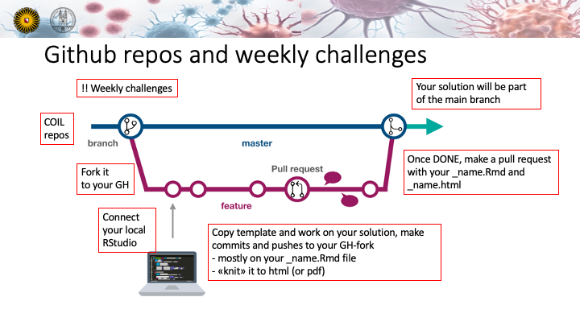

# OmicsInOncology_CPS341nBio435_FS25
This is the official gh repos for the COIL course of UU n UZH

## Course Description
The course will give an introduction into multiple Omics technologies (no wet-lab), including bioinformatics, and the basic concepts of oncology.You will learn not only the technological aspects of the different omics (genomics, transcriptomics, proteomics, & metabolomics).
Through lectures, work sessions, literature discussions, hands-on data analysis in R, and guest lectures from active researchers in the field, you will learn how different omics technologies work and how they are being used to solve those biological questions in oncology.

## Objectives of this repository
In this github repository we will share the assignments and R-challenges with you and you are supposed to "pull request" your solution back here.

# UU n UZH coil course
In this repository we will develop Rchallenges.

How this could look is visualized here
 

## How to use this repository
1. Fork this repository to your github and create a new branch for your group
2. Work on the Rchallenges
3. Push your changes to your branch
4. Create a pull request to merge your branch with the main branch
5. The pull request will be reviewed and merged

## About Markdown and html
A very useful cheatsheet for markdown can be found [https://github.com/adam-p/markdown-here/wiki/markdown-cheatshee](

https://github.com/adam-p/markdown-here/wiki/markdown-cheatsheet
