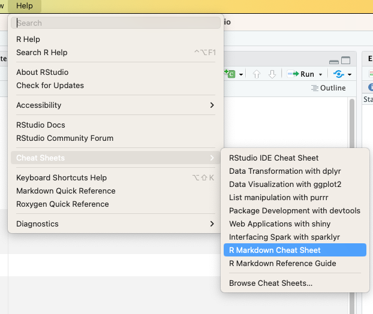

```{r load libraries, include=FALSE}
# install readr from CRAN
# install.packages("readr")
library(readr) # make sure your R has this library loaded, if not install it (see line above)
```

# Play around with RMardown

Try to play around with Rmarkdown. You can find a cheatsheet in RStudio under Help. 

{width=350px}
*RStudio has also linked Cheatsheets for Rmarkdown in the Help section*

You may include any other picture or do any other thing you like.

# Session Information

```{r sessionInfo, echo=FALSE, include=TRUE}
pander::pander(sessionInfo())
```


