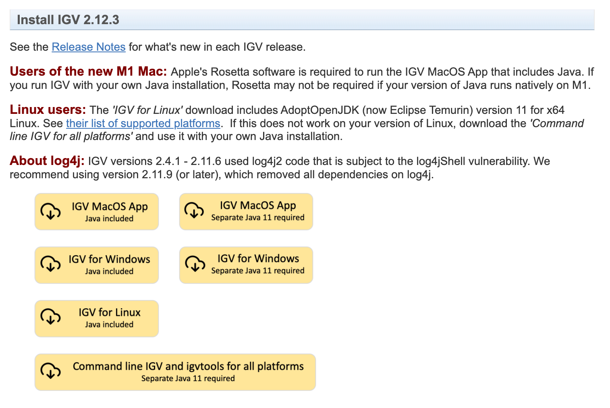
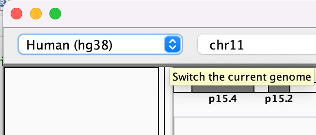
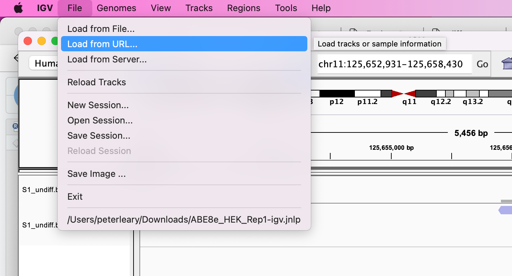
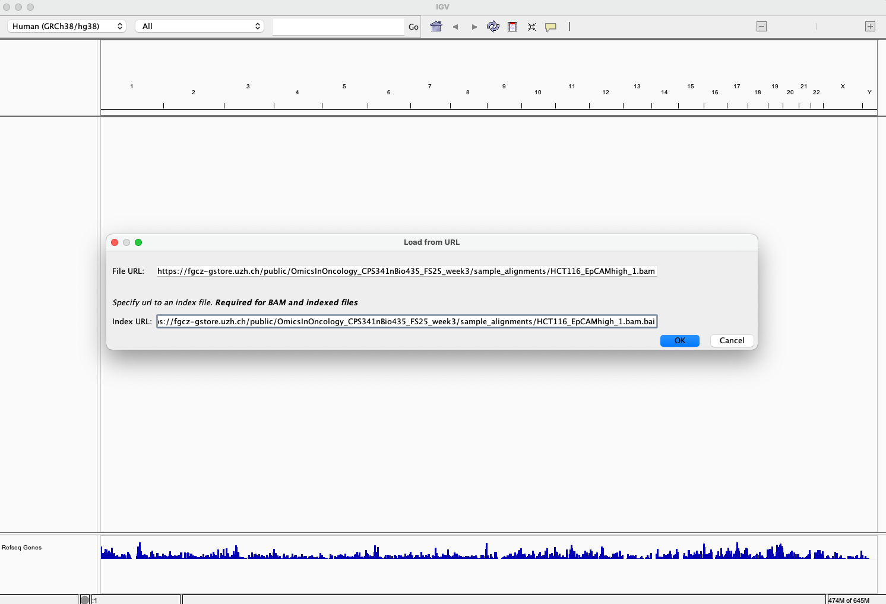
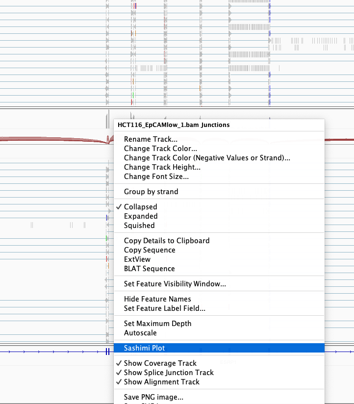

# Exercise 1 - Read Mapping and IGV
- Author: Falko Noé
- Date: 19/02/2025

Steps

1. [Download and install IGV](#4-download-and-install-igv-on-your-computer)

2. [Open IGV](#5-open-igv)

3. [Load the BAM files into IGV](#6-load-the-bam-files-into-igv)

4. [Questions](#7-questions)

----

### 1. Download and install IGV on your computer 

URL: https://software.broadinstitute.org/software/igv/download 

Should include Java as required. 

### 2. Open IGV 

Download the correct reference, which in our case, is **Human (hg38)**. If you can't see it on the list, click "More". 

### 3. Load the BAM files into IGV 

A set of alignments have been prepared for you, corresponding to  2 samples from 
our cancer bulk RNA dataset.

**Important**: You do not need to download these files. Simply copy the links 
and paste them into IGV as shown below.

HCT116_EpCAMhigh_1:

* https://fgcz-gstore.uzh.ch/public/OmicsInOncology_CPS341nBio435_FS25_week3/sample_alignments/HCT116_EpCAMhigh_1.bam

* https://fgcz-gstore.uzh.ch/public/OmicsInOncology_CPS341nBio435_FS25_week3/sample_alignments/HCT116_EpCAMhigh_1.bam.bai

HCT116_EpCAMlow_1

* https://fgcz-gstore.uzh.ch/public/OmicsInOncology_CPS341nBio435_FS25_week3/sample_alignments/HCT116_EpCAMlow_1.bam

* https://fgcz-gstore.uzh.ch/public/OmicsInOncology_CPS341nBio435_FS25_week3/sample_alignments/HCT116_EpCAMlow_1.bam.bai

#### Loading the files

### 7. Questions 

Search for the gene `ESRP1` and take a look at the reads mapped to this gene. 

- **Question 1**: What is the gene model? Do our reads map to the right part of the gene? (Hint: Take a look at the annotation track at the bottom)

- **Question 2**: Is the gene expressed in samples from both conditions? 

- **Question 3**: Is there a difference in the read coverage between samples from both conditions? (Hint: Take a look at the number of reads in the coverage track)

Next, right click on the sample track, select `Sashimi Plot`, and then `OK` to include both samples.

- **Question 4**: How many isoforms are identified? 

- **Question 5**: Look at the splice junctions, which isoforms are present almost exclusively in one sample? Which sample? 

