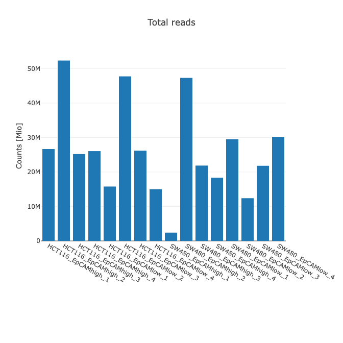

# Bulk RNA-seq Quantification

In this tutorial, we look at the results of bulk RNA-seq quantification. Our data
comes from the [following paper](https://pmc.ncbi.nlm.nih.gov/articles/PMC9674345/).

It is not important to understand the paper in detail. Just know we are dealing 
with two colon cancer cell-lines "HCT116" and "SW480" which have been FACS-sorted
according to the expression of CD44 and EpCAM, "EpCAMhigh" and "EpCAMlow", 
resulting in 4 groups with 4 replicates each.

- HCT116: EpCAMhigh

- HCT116: EpCAMlow

- SW480: EpCAMhigh

- SW480: EpCAMlow

We will focus on the tools available for QC rather than the underlying biology.

## Setup

### Load required packages

```{r load packages}
suppressPackageStartupMessages({
  library(SummarizedExperiment)
  library(pheatmap)
  library(RColorBrewer)
  library(stringr)
  library(plotly)
  library(tidyverse)
})
```

### Downloading counts

First, let's fetch the input count files generated from featureCounts for each sample. 

```{r setup}
ftpLocation <- "https://fgcz-gstore.uzh.ch/public/OmicsInOncology_CPS341nBio435_FS25_week3/feature_counts"
countDirectoryToUse <- "feature_counts"
dir.create(countDirectoryToUse, showWarnings = FALSE)

sampleNames <- c(
  "HCT116_EpCAMhigh_1",
  "HCT116_EpCAMhigh_2",
  "HCT116_EpCAMhigh_3",
  "HCT116_EpCAMhigh_4",
  "HCT116_EpCAMlow_1",
  "HCT116_EpCAMlow_2",
  "HCT116_EpCAMlow_3",
  "HCT116_EpCAMlow_4",
  "SW480_EpCAMhigh_1",
  "SW480_EpCAMhigh_2",
  "SW480_EpCAMhigh_3",
  "SW480_EpCAMhigh_4",
  "SW480_EpCAMlow_1",
  "SW480_EpCAMlow_2",
  "SW480_EpCAMlow_3",
  "SW480_EpCAMlow_4"
)

countFilenames <- paste0(sampleNames, ".txt")

for (fn in countFilenames) {
  download.file(url=file.path(ftpLocation, fn),
                destfile=file.path(countDirectoryToUse, fn))
}
```

You will notice a new directory called "feature_counts" in the same folder where
you executed this code. Take a quick look inside.

How were these counts generated?

  - Trimming with `fastp`
  
  - Alignment with `STAR` to the GRCh38.p13 reference genome
  
  - Running featureCounts from the Rsubread package using the GENCODE Release 42 
  GTF file. The file used can be found here on our [public FTP](https://fgcz-gstore.uzh.ch/public/OmicsInOncology_CPS341nBio435_FS25_week3)
  
The file is quite large and you need not be familiar with its format at this 
point or download it. What is important to know is that this file has been subset 
to only the protein_coding genes.

There are a few reasons why we might rather exclude transcript types such as 
lncRNA and snRNA.

- Including these other transcript types increase the number of tests, meaning 
more false positives, and less power to detect protein-coding genes

- non-coding RNAs do not have poly-A tails and can't be detected with mRNA 
sequencing, so their absence might be misinterpreted

- They are sometimes not well annotated and this can adversely affect enrichment 
analysis

In general, a good strategy is to exclude them by default and include them by 
demand (i.e. if the research question explicitly demands it).

### Loading counts

Now that the we have generated the counts, we can start exploring the data. We could proceed with either the counts generated by Kallisto or featureCounts. Let's load the featureCounts for now.

```{r metadata}
# Define meta dataframe for later use
meta <- data.frame(
  Condition=as.factor(c(rep("HCT116_EpCAMhigh", 4), 
                        rep("HCT116_EpCAMlow", 4),
                        rep("SW480_EpCAMhigh", 4),
                        rep("SW480_EpCAMlow", 4))),
  row.names=sampleNames
)

# Define some general-use parameters for use later
sigThresh <- 10  # significane threshold for the counts
conditionColours <- scales::hue_pal()(length(unique(meta$Condition)))  # choose pretty colours
# associate the conditions with the pretty colours
names(conditionColours) <- unique(meta$Condition)
sampleColours <- conditionColours[meta$Condition]
```

First, we load the counts and combine them into a single data-frame. Note we do this here manually, but there are methods like the `tximport` function which perform this operation in a convenient way, and beyond this, correct for biases in the counts. We will be using this method of import in the optional section on differential expression analysis.

```{r load counts, message=FALSE}
# Find the count files on the system
countPaths <- Sys.glob(file.path(countDirectoryToUse, sprintf("*%s.txt", rownames(meta))))
names(countPaths) <- rownames(meta)

# Load into memory and combine
countList <- lapply(rownames(meta), function(sn) {
  count <- vroom::vroom(countPaths[[sn]]) %>% 
    as.data.frame() %>%
    tibble::column_to_rownames(var="Identifier") %>%
    dplyr::rename_with(~sn)
  return(count)
})
rawCounts <- bind_cols(countList)

# Save merged data for later use
saveRDS(rawCounts, 
        file=file.path(countDirectoryToUse, "mergedCounts.rds"))
```

## Count Statistics

Let's look at the count statistics first. In the first of two plots, we get the total counts for each sample. In the second, we see how many features, and what fraction of all features, exceed our signal threshold.

```{r barplots}
toPlot <- tibble(
  Sample=colnames(rawCounts),
  `Read Counts`=colSums(rawCounts),
  `Fraction of features above threshold`=colSums(rawCounts > sigThresh),
  Percentages=paste(signif(100 * colSums(rawCounts > sigThresh) / nrow(rawCounts), digits=2), "%")
)
plot_ly(
  toPlot,
  x = ~Sample, 
  y = ~`Read Counts`, 
  type = "bar"
) %>%
  layout(title="Total reads", yaxis = list(title = "Counts [Mio]"))
plot_ly(
  toPlot, 
  x = ~Sample, 
  y = ~`Fraction of features above threshold`, 
  type="bar",
  text=~Percentages, textposition = 'auto'
) %>%
  layout(title="Genomic features with reads above threshold", yaxis = list(title = "Count"))
```

### Exercise #2

1.  How do the read counts compare to the initial FastQC report? See the plot below.



2.  How many features (in %) are above threshold? Do you think re-sequencing the 
samples with relatively low counts will be useful or provide a significant 
return on investment?

::: {.callout-note appearance="simple" collapse="true"}
### Solutions

1.  The counts after mapping and quantification are lower.

2.  All around 50-60%. Re-sequencing is unlikely to be worth our time, unless we 
are interested in very lowly-expressed genes. Even the sample with the lowest 
counts has almost as many features expressed above threshold as the sample 
with the highest read counts, despite having only a fraction of the counts.
:::

## Filtering Counts

Before continuing, we should filter out genes which are lowly expressed or absent, 
which we do on a per-group basis (think about why this might be). Next, 
we generate normalised counts using "Variance Stabilisation" as provided in 
the DESeq2 package. As per the documentation, this function calculates a 
variance stabilizing transformation (VST) from the fitted dispersion-mean 
relation(s) and then transforms the count data (normalized by division by the 
size factors or normalization factors), yielding a matrix of values which now 
have constant variance along the range of mean values (homoskedastic)[@DESeq2]. 
There are other functions we could use, such as `rlog` which is less sensitive 
to size factors, but VST works well in the general case.

First though, we want to filter the count matrix for genes which are 
informative, i.e. which are sufficiently expressed in the dataset and which
can stratify our data. Before, we defined a minimum threshold of `r sigThresh` 
at which we consider a gene expressed in a sample. Below, we do some 
calculations to determine if a gene is sufficiently expressed in our dataset at 
this treshold.

A simple approach would be to say that we want the gene expressed in at least,
for example, 25% of the samples. However, this simple approach might let some 
genes through which are in fact just noise in our data. Would we for example 
consider a gene to be important if it is expressed in only a single replicate
for every group? Probably not. So we can try something else.

Our strategy:

1. Within a group, do at least half the samples express the gene? If yes, we
consider the gene expressed in that group.

2. Do at least half the groups express the gene? If yes, we keep it. If no,
we toss it.

For our data, this means that we keep a gene if it is expressed in 2 or more 
samples within 2 or more groups.

```{r filtering}
# First filter genes 

# Which genes are above threshold?
isPresent <- rawCounts > sigThresh
# For every gene, how many samples within a group have it expressed?
isPresentCond <- rowsum(t(isPresent * 1), group=meta$Condition)
# For every gene for a particular group, is it expressed in at half the samples?
isPresentCond <- t(sweep(isPresentCond, 1,
                         table(meta$Condition)[rownames(isPresentCond)], FUN="/")) >= 0.5
# For every gene, is it expressed in at least 2 groups?
isValid <- rowMeans(isPresentCond) >= 0.5
# Subset the count matrix
rawCountsFilt <- rawCounts[isValid, ]

# Load data into a DESeq2 dataset so we can use the variance stabilizing function from DESeq2
dds <- DESeq2::DESeqDataSetFromMatrix(countData=rawCountsFilt,
                                      colData=meta,
                                      design=~Condition)
vsd <- DESeq2::vst(dds)

# Extract normalized counts
vsdSE <- SummarizedExperiment::assay(vsd)
```

Let's quickly compare the raw and normalised counts to see how they have changed.

```{r head counts}
head(rawCountsFilt)
head(as.data.frame(vsdSE))
```

## Dimensionality Reduction

We now have a count matrix of with the following dimensions: 16 x 14'392. In 
other words, we have represented each sample by a vector of 14'392 features. 
In order to adequately QC our samples, one important aspect is determining how 
similar or dissimilar one vector of genes from a specific sample is to that of 
another. However, interpreting 14'392 dimensions directly is not something that 
humans are generally capable of doing. This is where dimensionality reduction 
comes in. We would ideally like to *reduce* the given *dimensions* (a 
14'392-dimensional space), down to a 2- or 3-dimensional space, so we can 
visualise the result.

Two approaches, which are in fact related, are PCA (*principal component 
analysis*) and MDS (*multidimensional scaling*).

### PCA

PCA is a linear dimensionality reduction technique which, in essence, tries to 
find a rotation of the data in order to maximise the variance. This is a common
method for dimensionality reduction across many different disciplines within 
Computer Science and beyond. We will use the built-in R-method `prcomp` below to 
calculate the principal components and manually calculate the variance explained 
by each component.

Additionally, we will plot a 'scree' plot, which aims to visualise the variance 
explained by each principal component.

```{r PCA scree}
# Run PCA
pcDat  <- prcomp(t(vsdSE), scale. = FALSE)

# Calculate explained variance
varExp <- (100*pcDat$sdev^2)/sum(pcDat$sdev^2)

# Store the explained variance of top 8 PCs
varExp_df <- data.frame(PC= paste0("PC",1:8),
                          varExp=varExp[1:8])

# Scree plot
ggplot(varExp_df, aes(x=PC,y=varExp, group=1)) +
geom_point(colour="steelblue", size=4) +
geom_col(fill="steelblue") +
geom_line() + 
theme_bw() + ylim(c(0,100))
```

Let's now plot the first and second principal components in 2-dimensions.

```{r PCA plot}
plot_ly(as.data.frame(pcDat$x), 
        x=~PC1, y=~PC2, 
        color=meta$Condition, 
        colors="Set1",
        type="scatter", 
        mode="markers") %>%
  layout(title="PCA Plot")
```

### Multi-dimensional scaling (MDS)

Multi-dimensional scaling is another dimensionality reduction which aims to best 
reconstruct pairwise distances between a set of points given a set of distances. 
Since in the case of RNA-seq we are given the data vectors directly rather than 
the distance matrices, methods must calculate the distance matrix first upon which 
the MDS algorithm is then performed. PCA is used in the process to produce a 
reduced dimensionality projection from the similarities.

Here, we use limma [@limma] to calculate the MDS and use plotly to visualise the 
pairwise distances in 3-dimensions.

```{r MDS plot}
mds <- limma::plotMDS(vsdSE, plot=FALSE)
mdsOut <- mds$eigen.vectors[,1:3]
colnames(mdsOut) <- c("Leading logFC dim1", 
                      "Leading logFC dim2", 
                      "Leading logFC dim3")
toPlot <- cbind(meta %>% rownames_to_column("Sample"), mdsOut)
plot_ly(toPlot, 
        x=~`Leading logFC dim1`, 
        y=~`Leading logFC dim2`, 
        z=~`Leading logFC dim3`, 
        color=~Condition, 
        colors="Set1", 
        type='scatter3d', 
        mode='markers+text', 
        text=~Sample, 
        textposition = "top right") %>%
  plotly::layout(title="Classical MDS", 
                 scene=list(xaxis=list(title = 'Leading logFC dim1'), 
                            yaxis = list(title = 'Leading logFC dim2'), 
                            zaxis = list(title = 'Leading logFC dim3')))
```

::: {.callout-note appearance="simple" collapse="true"}
#### PCA vs MDS

The following image and linked StackedOverflow post explains well the difference 
between the two methods.

[{fig-alt="Visual explanation of the 
difference between PCA and MDS" fig-align="center"}](https://stats.stackexchange.com/questions/14002/whats-the-difference-between-principal-component-analysis-and-multidimensional)
:::

### Exercise #2

1.  How many genes are used by the function `plotMDS` as inputs. What kind of 
genes are these?
2.  Change the above function call so that all genes in the count matrix are 
used as input.

::: {.callout-tip collapse="true" appearance="simple"}
#### Solutions

1.  By default, the top 500 genes are used.

2.  We must change the `top` argument in order to include all necessary genes.

    ```{r, eval=FALSE}
    mds <- limma::plotMDS(vsdSE, top=nrow(vsdSE), plot=FALSE)
    ```
:::

## Correlation Plots

We can also quantify the similarity between samples using correlations. This 
involves simply computing pairwise correlations between samples using the gene 
count vectors of each samples as inputs. The following methods this method as a 
basis.

### By-Sample Dendogram and Correlations

We can use hierarchical clustering using the pearson correlations as inputs. 
This will group samples together in a hierarchical fashion in a tree-like 
structure.

```{r dendogram}
d <- as.dist(1-cor(vsdSE, use="complete.obs"))   # calculate the pairwise correlations
hc <- hclust(d, method="ward.D2")  # run the clustering algorithm
WGCNA::plotDendroAndColors(hc, sampleColours, autoColorHeight=TRUE, hang = -0.1)
```

### Correlation Heatmap

Similarly, we can call `pheatmap` on the correlations to easily visualize the 
similarity between samples within and across conditions.

```{r correlation heatmap, fig.width=12, fig.height=12}
# Pearson correlation plot 
pheatmap(
  mat               = cor(vsdSE, use="complete.obs"),
  treeheight_row    = 100,
  treeheight_col    = 100,
  cutree_rows       = 2, 
  cutree_cols       = 2,
  silent            = F,
  annotation_col    = meta,
  annotation_colors = list(Condition = conditionColours),
  color             = brewer.pal(n = 9, name = "Blues"),
  fontsize_row      = 12, 
  fontsize_col      = 12,
  display_numbers   = TRUE,
  fontsize_number   = 12)
```

### Top 2'000 Variable Genes Heatmap

```{r pheatmap 2k variable}
# First, we center the matrix
vsdSECentered <- sweep(vsdSE, 1, rowMeans(vsdSE))
# Identify high variance features
topGenes <- rownames(vsdSE)[head(order(rowSds(vsdSE, na.rm=TRUE),
                                            decreasing = TRUE), 2000)]

countsToPlot <- vsdSECentered[topGenes,]

# Clustering of high variance features
hmObj <- pheatmap(countsToPlot, 
         clustering_method="ward.D2",
         scale = "row", cluster_rows = TRUE,
         cluster_cols = TRUE, show_rownames = FALSE,
         cutree_rows = 6, cutree_cols = 2,
         treeheight_row = 50, treeheight_col = 50,
         annotation_col = meta,
         fontsize_row = 8, fontsize_col = 9,
         annotation_legend = TRUE,
         fontsize=8)
hmObj
```
