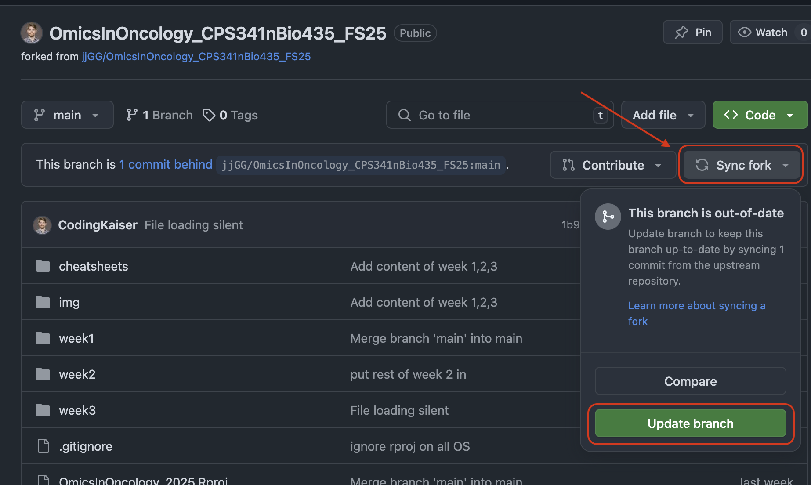

## Week3 Setup Instructions

### 1. Sync your fork with the official repo

You will likely have to sync your fork with the main repo.

To do this, navigate to **your** forked repo on GitHub.

Next, Click on "Sync fork", and then "Update Branch", like so:

Your project should now have all of the week3 material.

### 2. Install required R packages

For each of the coding-based exercises, you will find a corresponding file 
called `install.R` which you should run so you have all of the required 
packages installed. Simply open the file and run the lines as you would 
normally.

* For the guided exercise in [3_quantification](3_quantification) **and**
the [friday_challenge](friday_challenge), run the `install.R` inside 
[3_quantification](3_quantification)

* For the optional exercise in 
[4_differential_expression](4_differential_expression), run `install.R`
inside that directory
 
