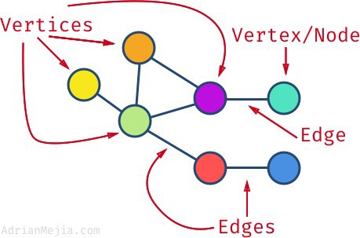
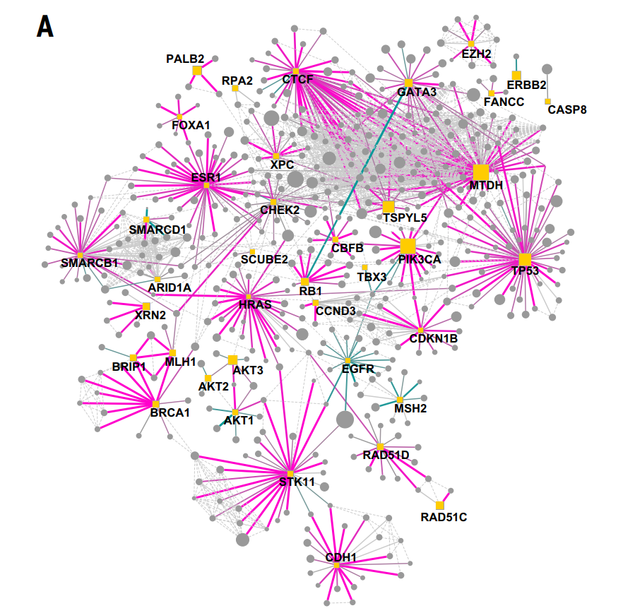

# Introduction

The goal of this Tutorial is to learn some techniques to display and analyze protein-protein interactions (PPI's) using R. We will use a Science article for it from which we will take the data.

## Article: A protein interaction landscape of breast cancer
Kim et al. 2021, Science 374, 50

This research makes use of protein-protein interactions as observed using affinity purification and mass spectrometry (AP-MS). The article focuses on new interactions.

We want to visualize PPI's and perform some basic analysis on it.  
This plots are not going to be 100% the same as in the article, that would involve too many expert steps. However by using R functions we can create some PPI Maps of the AP-MS data.  
Furthermore, we learn some techniques to further go into some depth on the proteins that interact. Like what the function(s) they might have in a cell, or in which biological process they act.

In this COO we will _not_ generate exactly the same plots as in the article, but look at the data itself and the information it contains.

*the article (pdf) is available in the folder of this tutorial*

## Libraries used for this tutorial:

- STRINGdb: a library to visualize Protein Protein Interactions (PPI's) based on published (experimental) data 
- magrittr: together with tidyverse it allows the use of %&lt;&gt;%
- readxl and writexl: libraries to open and write microsoft excel files
- RGBL: is used in 'network' analysis using graph theory
- RGraphviz: a library to visualize PPI's 
- graph and igraph: libraries that provide tools for PPI analysis


```{r setup, include=FALSE}
library(STRINGdb)
string_db <- STRINGdb$new( version="11.0b", species=9606, score_threshold=200, input_directory="")
library(readxl)
library(writexl)
library(magrittr)
library(RBGL)
library(Rgraphviz)
library(graph)  # https://www.bioconductor.org/packages/devel/bioc/manuals/graph/man/graph.pdf
library(dplyr)
```

# What is a graph?!

We're interested in working with protein interaction data in R. Before we can do that we need to gain some knowledge.

A graph is the mathematical term for a structure that links things together into a kind of network
- A graph in this sense is not a 'plot', although the word is used for that often
- You can plot a graph, it looks like this:
 

## Nodes
- Nodes (or vertices) are the 'things' that are connected, for instance proteins
 - Other examples are people or pieces of information, think of the pictures in a detective series, which are connected with strings of wire:
 


## Edges
- The connections between the nodes are called _edges_ (see the picture above)
 - Observe that a node can be connected to multiple other nodes

## Degree
- The number of edges connected to a node is called it's _degree_

## Direction of edges (or not)
- Sometimes, there is just 'some connection' for instance two proteins bind, therefore get an edge without direction (term 'undirected')
- Sometimes there is cause and effect, then you have a 'directed' edge, this is shown with an arrow
 - Example: a kinase phosphorylates some proteins, so arrows are drawn from the enzyme to it's targets


# Graphs in R
You can imagine describing a graph in R, is not as easy as storing a list of numbers. We will need something more 'smart'.  
The simplest way to write down a graph, is just to write out all of the connections. For example:  
'Protein A' interacts with 'Protein B'
'Protein A' interacts with 'Protein C'
'Protein D' interacts with 'Protein E'  
etc.

If you think about it, the nodes of the above graph would be Proteins A, B, C, D and E, so all the unique names in the list. The edges are fully described by the listed interactions.

This, in practice, is how to present graphs to R. There is a specific library that takes this kind of information and turns it into a complex datastructure called **graphNEL** (https://www.bioconductor.org/packages/devel/bioc/vignettes/graph/inst/doc/graph.pdf). Having the graph in this structure makes it very easy to show the graph, and to investigate it.

Because we're interested in the PPI described in the article, we're giving you a ready-made function that we're going to use in today's Tutorial. We use terms related to the article (i.e. baits and preys and proteingraph).

Basically the graph data structure are two vectors: one with *baits* and one with *preys* similar the the interaction list above. The function turns these into a graph with the correct nodes and edges.

## Here is the function:
1. Just run this section to put this function in memory.

```{r makeproteingraph function}
# Create a protein-protein interaction graph based on 2 or 3 vectors:
# - baits
# - preys
# - weights, optional, gives the strength of the edge
makeproteingraph <- function(baits, preys, weights=1) {
  
  allproteins <- c(baits, preys)
  uniqueproteins <- unique(allproteins)

  # First we create a collection of all nodes, they are not connected yet
  proteingraph <- new("graphNEL", nodes = uniqueproteins)

  # Add edges to the graph:
  # See http://rss.acs.unt.edu/Rdoc/library/graph/doc/graph.pdf for more examples
  
  proteingraph <- addEdge(baits, preys, proteingraph, weights)

  return(proteingraph)
}
```

## Investigating the 'makeproteingraph' function with some examples

To see if our function works we can create a simple graph ourselves. For that we'll create a bait and a prey vector.
We will experiment with the baits and preys to get an idea about how these graphs work.

The following is an overview of the methods we are going to use.

Remember you can get help about functions from packages, using '?'.

### Pre-cooked example 

First a simple example. Functions are given to show how to create the graph structure (our function) and how to lay-out and plot the graph.

In this example 'A' is always the bait and it binds to 'B', 'C', 'D' and 'E'. You have to think of these as pairs, so the first element of the baits is linked to the first element in the preys.

``` {r}
baits <- c("A", "A", "A", "A")
preys <- c("B", "C", "D", "E")

#First we use our function to create the graph

simple_example_graph <- makeproteingraph(baits, preys)

# Now we use 'layoutGraph' and 'renderGraph' from Rgraphviz to make a graphical output

example_graph_plot <- layoutGraph(simple_example_graph, layoutType="neato")

renderGraph(example_graph_plot)

```

### 1. Change the code below to *add* bait 'B' that binds to preys 'F' and 'G'.

Do you understand why the plot looks the way it looks?

``` {r}
baits <- c("A", "A", "A", "A")
preys <- c("B", "C", "D", "E")


#First we use our function to create the graph

simple_example_graph <- makeproteingraph(baits, preys)

# Now we use 'layoutGraph' and 'renderGraph' from Rgraphviz to make a graphical output

example_graph_plot <- layoutGraph(simple_example_graph, layoutType="neato")

renderGraph(example_graph_plot)

```

### 2. Change the code below to add preys 'F' and 'G', which bind to a bait 'I'

Do you understand why the plot looks the way it looks?

``` {r}
baits <- c("A", "A", "A", "A")
preys <- c("B", "C", "D", "E")


#First we use our function to create the graph

simple_example_graph <- makeproteingraph(baits, preys)

# Now we use 'layoutGraph' and 'renderGraph' from Rgraphviz to make a graphical output

example_graph_plot <- layoutGraph(simple_example_graph, layoutType="neato")

renderGraph(example_graph_plot)

```

# Making a graph of the article data

## loading the supplementary data into a variable: using readxl

With the libraries in memory we will start by loading in the supplementary data of the article.
All the 'raw' data is in supplementary table S3. The other tables contain the same data, however in other stages of post\-processing and hence more refined.

For the purpose of this tutorial we will use the data from supplementary data S6 (science.abf3066_Table_S6.xlsx). This excel file contains two (2) sheets, README and "Differential Interaction Score", we need the latter.

- For information on how to use this library, take a look at https://readxl.tidyverse.org
- and https://github.com/rstudio/cheatsheets/blob/main/data-import.pdf for the cheat sheet. Page 2 is about read_xlsx() the function you need.

### 1. Load the supplementary data of S6 and the correct sheet into a new variable **SuppS6**

It is good practice to investigate the content of a variable, to check if you have to correct data and/or see if everything worked as intended.
For this you can use the print() or head() function. However also just typing the variable name will often also work.

```{r}
## lets load our supplementary data
SuppS6 <- 

```

### 2. Check the loaded data

```{r}

```

Now we know what our function does, let's have a look at our experimental data.

SuppS6 contains a Bait and a Prey column. It also contains two additional columns, with an other identifier (uniprot) for these proteins.  
We will use Bait and Prey, but it will work equally well with the other two columns.

For convenience we will first store the content of these columns in their own variables: **baits** and **preys** as we will use them in later steps again, but this step isn't needed as we can also directly use these 'columns' as input in our *makeproteingraph(.. , ..)* function.

### 1. Store the content of the *Bait column* in a variable **baits** and the *Prey column* in **preys**

```{r}

```

### 2. use the *makeproteingraph(.. , ..)* function and store the output in the variable **interactionGraph** (this is now a *graphNEL-object*)

```{r}

```

3. "print" the content of the interactionGraph variable (don't use head or print, just type the variable name)

```{r}

```

4. Look at our examples above and try to create a plot of our interactionGraph

We will make use of the neato layout **layoutType="neato"** (there are more layout types, but 'calculating' these is slow). 


```{r}

```


`` ``

1. and now you can call rendergraph on your graphNEL-object 

```{r}
## use the example code above to layout the graph, and run the renderGraph(..) function (1.)
```

**Take a look at the graph below.. It doesn't look the same but trust me it is the same PPI information as in figure 2A. However they have made it much better looking.**



Figure 2H in the article uses the same data, however now only shows the interactions that are commonly found in the cancer lines and not in the mcf10A line.
In other words, they only look at those PPI's that are specific for cancer cells and not observed in the 'normal' mcf10a line.

The supplementary data has a DIS column. The autors describe that a *positive DIS* means that it is *specific to cancer* lines (README part in TABLE S6)

https://www.rstudio.com/wp-content/uploads/2015/02/data-wrangling-cheatsheet.pdf

hint: We will need to subset Observations (rows).

1. Create a subset table variable **SuppS6_sub**, and filter for DIS > 0.5

```{r}
dim(SuppS6)
SuppS6_sub <- SuppS6 |> filter(DIS > 0.5)
```

2. output the content of SuppS6_sub, as a check

```{r}
head(SuppS6_sub)
dim(SuppS6_sub)
```

#### make a PPI plot of the subset
We have our subset, which should contain only the PPIs found in cancer lines.
Of course we like to plot this as well, like we did with the complete dataset.

1. make a new graphNEL-object and call this: *ppiGraph* (use the makeproteingraph(..,..) function). hint First create a baits_sub and preys_sub variable that contain the baits and preys from this subset table. 
2. output the ppiGraph to see the number of nodes and edges


*All the steps above are similar to the steps you did for the 'complete' dataset*

```{r}

```

3. layout the ppiGraph using the layoutGraph(.., layoutType="neato") function
4. render the graph.

```{r}

```

## Let's make the plot more informative

Similar to the figure in the article we would like to highlight the baits a bit better. Also the preys are a bit crowded.

Below you find an example code that takes the baits, makes them blue, and changes the circle nodes into rectangles. It also changes the font size for the baits and makes the font for the preys very small (invisible). 

However for this tutorial I will provide the code (below). Try to see if you understand the code. Run it and maybe play with the code a bit to change the visualization to your liking.

In short this is what the code below does:

1. It starts by again layouting the graph (it basically gets rid of previous layouts). You can try the **fdp** layout if you like.  
2. All the settings are done by creating a vector. This list has per element a **name** which is the bair or prey name, and per name a setting, like the fontSize, color etc. This allows for a *per* Node (which can be a bait or prey) setting. Here we just fill the list with one color or font size or whatever setting we want to change. SO all baits are blue, and fontsize 48 etc.. For each setting we create a new list. This system can also be used to change the format of the EDGES.  
3. graph.par is to set a title and subtitle  
4. render the graph

The nitty gritty details are in: https://www.bioconductor.org/packages/devel/bioc/vignettes/Rgraphviz/inst/doc/newRgraphvizInterface.pdf

```{r}
SuppS6_sub <- filter(SuppS6, DIS > 0.5)
ppiGraph <- makeproteingraph(SuppS6_sub$Bait, SuppS6_sub$Prey, SuppS6_sub$DIS)


ppiGraph <- layoutGraph(ppiGraph, layoutType="neato") #layoutType="fdp" is also cool, but slow, try it out!

## formatting the prey nodes (SuppS6_sub$Prey)
preyFont <- rep(1, length(SuppS6_sub$Prey)) #assign a very small font size to the prey nodes
names(preyFont)<-SuppS6_sub$Prey


## formatting the bait nodes (SuppS6_sub$Bait) 
fill <- rep("lightblue", length(SuppS6_sub$Bait)) #assign the blue color to the bait nodes
names(fill) <- SuppS6_sub$Bait

shape <- rep("box", length(SuppS6_sub$Bait)) #assign the box shape to the bait nodes
names(shape) <- SuppS6_sub$Bait

baitFont <- rep(48, length(SuppS6_sub$Bait))#assign the font size to the bait nodes
names(baitFont) <- SuppS6_sub$Bait

lwd <- rep(2, length(SuppS6_sub$Bait)) #make the borders around the bait nodes squares 2px thick.
names(lwd) <- SuppS6_sub$Bait


## the nodeRenderInfo takes these list with parameters (settings) and uses that format the graph.
nodeRenderInfo(ppiGraph) <- list(fontsize=preyFont)
nodeRenderInfo(ppiGraph) <- list(fontsize=baitFont) 
nodeRenderInfo(ppiGraph) <- list(fill=fill)
nodeRenderInfo(ppiGraph) <- list(shape=shape)
nodeRenderInfo(ppiGraph) <- list(lwd=lwd)
nodeRenderInfo(ppiGraph) <- list(lty=1)

## some additional markup stuff, set at title and subtitle.
graph.par(list(nodes=list(fontsize=36), graph=list(main="PPI NETWORK", sub="DIS > 0.5", cex.main=1.8, cex.sub=1.4, col.sub="gray")))

## finally we use the renderGraph function to draw the graph again
renderGraph(ppiGraph)

```

Maybe this plot is not 1:1 the same look and feel as the article one, but it is much more informative like this.

# Extracting information from our graphs

We can get a lot of information from the plots
- What connects to individual nodes?
- How many connections does a node have? (Are they *key players*?)
- What is the distribution of the amount of connections? (tells you something about )

## Functions for analyzing graphs

We've loaded the 'graph' package and are therefore using GraphNEL graphs.
The number of connections per node can be found with the 'degree' function.
Sort the output of this function to give a nice overview of what proteins have the most connected proteins.

```{r}


```

### Create a counts table

In R, there is a function called 'table', that will give you the possibility to count frequencies of something. Here, we can do that with the degrees, so we can summarize how many 1s, 2s and other numbers are there.
Use this function to analyze the output of the degree function from above

```{r}

```
```{r}
hist(sort(degree(ppiGraph)))
```

### About these results

How many proteins with a degree of '0' do you find? How many proteins with a degree of 1? How many with a degree greater than 40? 
Explain why you see this. Think about it, also in terms of the experiment we're analyzing

_______________________________

Type your answer here!

_______________________________

### Connected components

Extract the connected components from our graph using the connectedComp method. What do you think connected components are?
Assign the outcome to a variable with a name you will still understand when we wake you up at night (hypothetically of course!).

```{r}

```

### Find all connections to a particular protein

Read about the 'adj' function, and extract all interactors of the TP53 protein.

```{r interactors with adj}
#START_ANSWER
adj(ppiGraph, 'TP53')
#END_ANSWER
```
