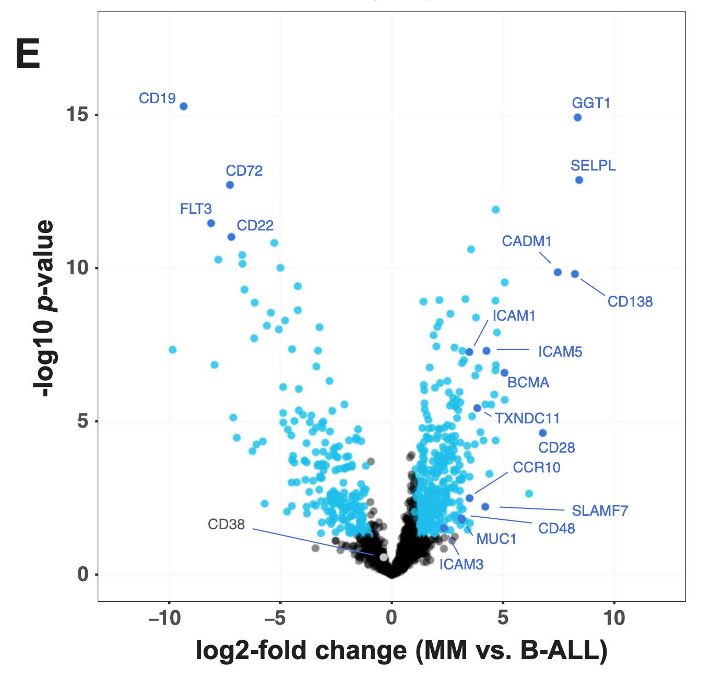

# Introduction

In this R-challenge we would first like to reproduce a volcano plot from an article using the provided supplementary data and then apply some of the skills we have learned in the previous weeks. Basically, in the same article, the authors also provide a matrix with the expression of the proteins in the surfaceome of multiple myeloma cells. We will try to visualize this matrix as a heatmap, a correlation heatmap or a PCA/MDS plot.

__Article: The surfaceome of multiple myeloma cells suggests potential immunotherapeutic strategies and protein markers of drug resistance__
DOI: 10.1038/s41467-022-31810-6

The article "The surfaceome of multiple myeloma cells suggests potential immunotherapeutic strategies and protein markers of drug resistance" by Ferguson et al. presents a comprehensive investigation of the surface proteome, or surfaceome, of multiple myeloma cells. This study is pivotal as it explores how the surfaceome influences the interaction between tumor cells and their microenvironment, making it a critical area for potential therapeutic advancements and understanding drug resistance mechanisms [@Ferguson2022-sc].

The authors employed glycoprotein capture proteomics to systematically characterize the myeloma surfaceome under various conditions: at baseline, when facing drug resistance, and in response to acute drug treatments. This methodology allowed for a detailed examination of surface antigens that could be targeted for immunotherapy. The findings from this study include the establishment of a scoring system to evaluate and prioritize these surface antigens based on their potential therapeutic value [@Ferguson2022-sc].

One of the most significant outcomes of the study is the identification of CCR10 as a promising target for immunotherapeutic intervention. The expression of CCR10 was noted to be prevalent among malignant plasma cells, suggesting that therapies targeting this marker could enhance treatment efficacy. This provides a strategic direction for developing new immunotherapies aimed specifically at overcoming the challenges associated with drug resistance in multiple myeloma [@Ferguson2022-sc].

Overall, the article provides vital insights into the complexity of the myeloma surfaceome and reinforces the need for continued exploration into targeted therapies that can improve clinical outcomes in patients suffering from multiple myeloma.
*the article (pdf) is available in the folder of this tutorial*


## Libraries used for this tutorial:
You may not need all of these listed here.

- tidyr, dplyr: data handling from the tidyverse
- magrittr: together with tidyverse it allows the use of %&lt;&gt;%
- readxl and openxlsx: libraries to open and write microsoft excel files
- ggplot2: produce nice plots
- pheatmap: to great nice (pretty) heatmaps from matrices
- ggtree: to plot phylogenetic trees
- ape: to read and manipulate phylogenetic trees
- viridis: to get nice color scales
- DESeq2, plotly, limma, SummarizedExperiment: to generate similar QC plots as in week 2
- ggrepel: to avoid overplotting of labels in ggplot2

## Idea in this R-challenge:
* Find the excel sheet, look at it, see what is relevant and then try to do the coding
* One sheet in this excel book is relevant but only part of it, try to restructure it R the way you need it
* Try to use AI in this challenge at multiple steps (restructure the data, plotting w/ ggplot) if it is not immediately obvious to you how to do it.


```{r setup, include=FALSE}

if (! "BiocManager" %in% installed.packages()[,1]) {
  install.packages("BiocManager")
}

library(BiocManager)

# you may eventually need one of these packages.. therefore we directly install all of them
needed_packages <- c("tidyverse", "tidyr", "dplyr", "readxl", "ggplot2","openxlsx", 
                     "ggtree", "viridis", "ggrepel", "pheatmap", "SummarizedExperiment", 
                     "RColorBrewer", "magrittr", "DESeq2", "ape", "tibble", "plotly", "limma")

for (package in needed_packages) {
  if(! package %in% installed.packages()[,1]) {
    install(package, update = FALSE, ask=FALSE)
  }
  library(package, character.only = TRUE)
}
library(limma)
library(SummarizedExperiment)
library(plotly)
library(tibble)
library(magrittr)
library(DESeq2)
library(dplyr)
library(ggplot2)
library(tidyverse)
library(openxlsx)
library(ggtree)
library(ape)
library(viridis)
library(pheatmap)
library(ggrepel)
library(RColorBrewer)
```


# Goal 1: Redo Figure 1E from the article

Below here we show the Figure 1E from the article. We will try to reproduce this figure with the data provided in as supplement in an excel file.
_Try first to understand what this plot is showing. And explain it here, also indicate what columns are potentially relevant in this sheet (not all of them you need to use). Something like: on this volcano we see .. _ 
 

```{r readInData, echo=FALSE, include=TRUE}
# read in the data and put it into an object (e.g. dat) have a look at the head of the data

print("here we look into head of the data")

```


```{r reshapeData, echo=FALSE, include=TRUE}
# ideally you reshape the data into another object by selecting only necessairy columns
# maybe also rename the columns to make it easier to work with

# rename columns

```


```{r someFirstVolcano, echo=FALSE, include=TRUE}
# do a minimal volcano plot just to see if it works

```


```{r volcano With Significance colored, echo=FALSE, include=TRUE}
# usually proteins with a p-value < 0.05 and a log2FC > 1 (or -1) are considered significant

# define threshold for significance and use different color
abs_log2_threshold <- 1
pvalue_threshold <- 0.05

```


```{r add some lables found in a file, echo=FALSE, include=TRUE}
# Now in the plot, some labels are added to some interesting proteins (POIs)
# read in another txt with the proteins of interest


```


```{r maybe there is overplotting try with ai, echo=FALSE, include=TRUE}

```


```{r next version some labels are overplotted can you do it better with ai, echo=FALSE, include=TRUE}
# a nicer version of it with ggrepel

```

# Goal 2: Try to visualize the expression matrix as a heatmap and make some QC plots

The authors of the article also provide a matrix with the expression of the proteins in the surfaceome of multiple myeloma cells. 
Please also remember the QC-plots from week 3. We will try to visualize this matrix as a heatmap and do some more QC plots such as correlation heatmap or a PCA/MDS plot.


```{r look at excel sheet again and get matrix out, echo=TRUE, include=TRUE}
# Do you find a pattern that matches all the columns that you want? There is a regEx pattern that matches the columns of interest


```
First some reshaping is necessairy again.

### A heatmap with clustering 

```{r pheatmap, echo=FALSE, include=TRUE}
# use the pheatmap package. It works on wide format
# Generate the heatmap with clustering (using pheatmap)

```

### A Correlation-Heatmap

```{r correlation plot or pca, echo=FALSE, include=TRUE}
# corr

```

## Some QC plots like in week 3

### First again some reshaping
Here we take the recipe from week 3 and apply it to the data we have here.
Important here is that the __protein names__ are redundant that causes problems. 
Therefore we take the Uniprot_ID instead of the protein names to generate the SummarizedExperiment object.

```{r qc plots ala week3 prepare it, echo=TRUE, include=TRUE, warning=FALSE}


```
### PCA and MDS plots like in Week 3

```{r PCA plot, echo=TRUE, include=TRUE, warning=FALSE}
# Do PCA


```

### Correlation plot like in week 3

```{r corrPlot like in week 3, echo=TRUE, include=TRUE, warning=FALSE}
# Pearson correlation plot 

```

# Session Information

Here we show the session information of the packages used in this tutorial as well as the references can be found below.

```{r sessionInfo, echo=FALSE, include=TRUE}
pander::pander(sessionInfo())
```


# References


